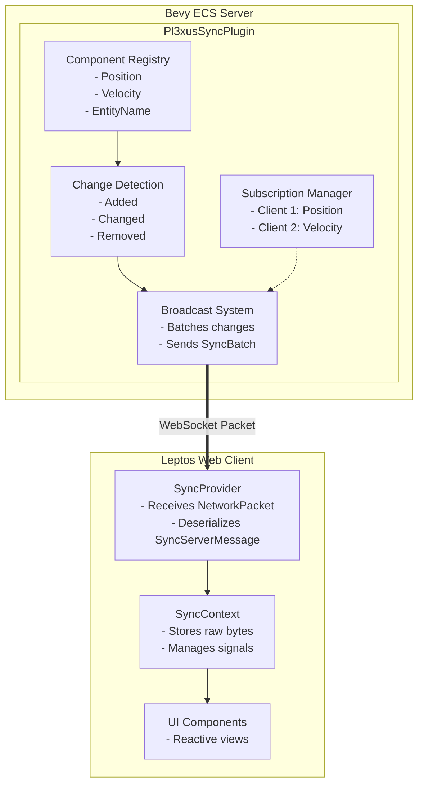

# Architecture Reference

This document provides architectural reference for pl3xus contributors.

---

## System Overview

`pl3xus_sync` is a synchronization middleware that enabling real-time bidirectional synchronization between a Bevy ECS server and arbitrary clients.

### Components

- **Server-side** (`pl3xus_sync`): Bevy plugin that tracks component changes and broadcasts updates
- **Client-side** (`pl3xus_client`): Leptos-based reactive client library with automatic subscription management

---

## Architecture Diagram



---

## Wire Protocol

All messages are wrapped in `NetworkPacket` for transport:

```rust
pub struct NetworkPacket {
    pub type_name: String,      // Fully qualified type name
    pub schema_hash: u64,       // Schema version
    pub data: Vec<u8>,          // Bincode-serialized message
}
```

### Client → Server Messages

```rust
pub enum SyncClientMessage {
    Subscription(SubscriptionRequest),
    Unsubscribe(UnsubscribeRequest),
    Mutate(MutateComponent),
    Query(QueryRequest),
    QueryCancel(QueryCancel),
}
```

### Server → Client Messages

```rust
pub enum SyncServerMessage {
    SyncBatch(SyncBatch),           // Component updates
    MutationResponse(MutationResponse),
    QueryResponse(QueryResponse),
}
```

---

## Key Data Flows

### Subscription Flow

1. Client calls `use_sync_component::<Position>()`
2. Hook sends `SubscriptionRequest` to server
3. Server adds subscription to `SubscriptionManager`
4. Server sends initial snapshot (all matching entities)
5. Server sends incremental updates on changes

### Mutation Flow

1. Client calls `ctx.mutate::<Position>(entity_id, new_value)`
2. Client sends `MutateComponent` to server
3. Server validates via `MutationAuthorizer`
4. If approved: component updated, change broadcasted
5. Server sends `MutationResponse` to client

### Change Detection Flow

1. Bevy's change detection marks components as changed
2. `broadcast_component_changes` runs each frame
3. Changes collected into `HashMap<ConnectionId, Vec<SyncItem>>`
4. One `SyncBatch` sent per subscribed connection

---

## Design Philosophy

### Industrial Applications First

The system is designed for:
- **High frame rates** (30-60+ FPS updates)
- **High throughput** (thousands of component updates per second)
- **Low latency** (sub-frame response times)
- **Deterministic behavior** (predictable performance under load)

### Per-Frame Batching

All component changes are batched per frame:
- One `SyncBatch` message per connection per frame
- At 60 FPS: 60 messages/second per client
- Efficient for high-update-rate applications

---

## Related Documentation

- [Server Setup Guide](../core/guides/server-setup.md)
- [Subscriptions Guide](../core/guides/subscriptions.md)
- [Performance Reference](./performance.md)

---

**Last Updated**: 2025-12-07

