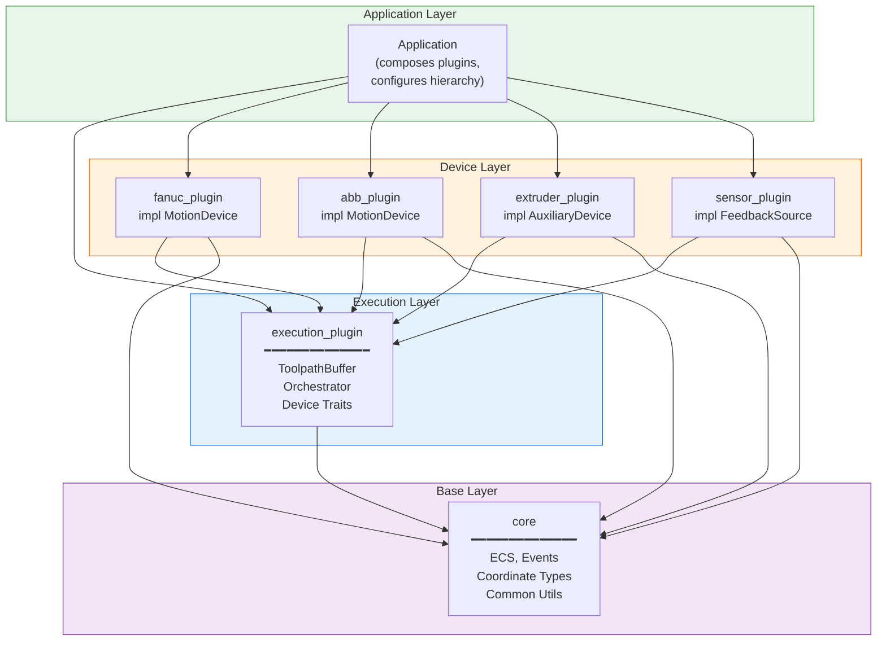
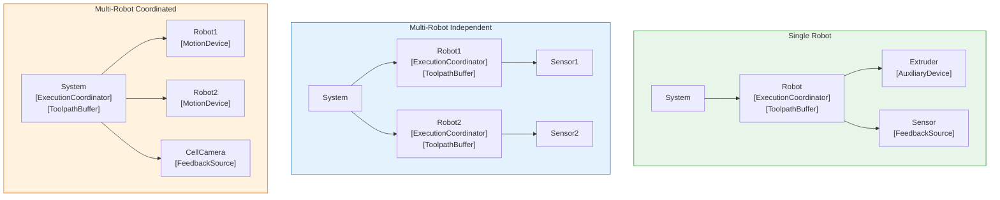
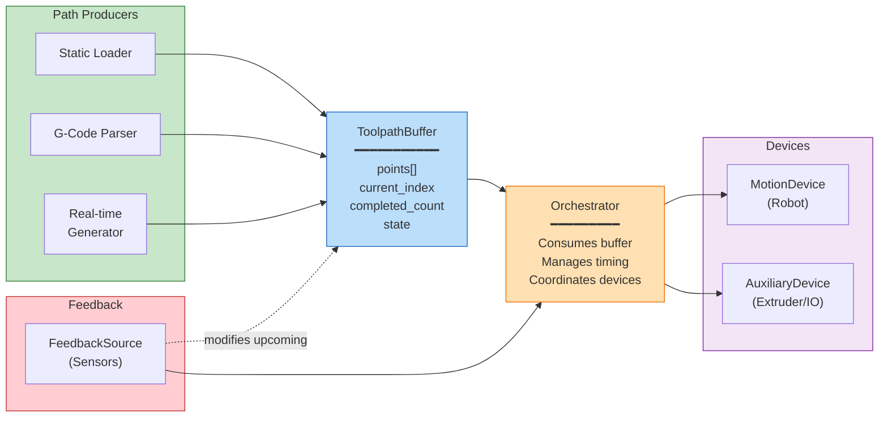
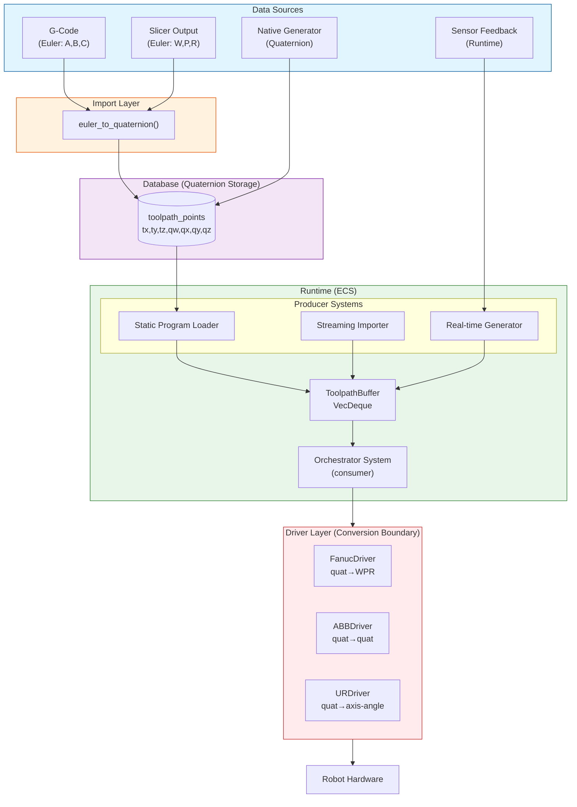
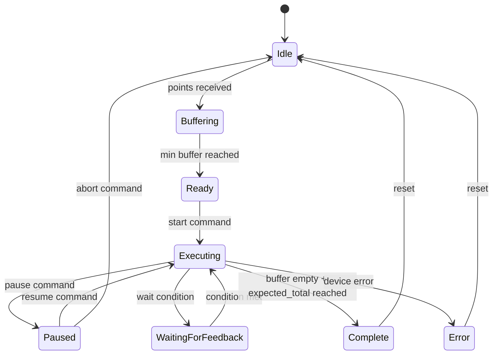
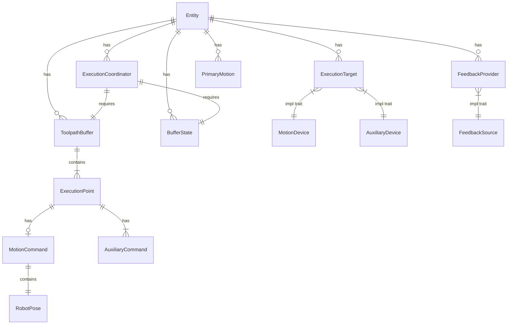
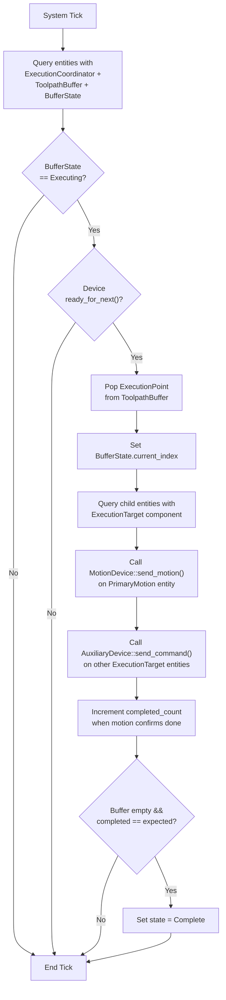

# Execution Plugin Diagrams

This file contains Mermaid diagram source code for the execution plugin architecture.

## 1. Plugin Dependency Graph

## 2. Entity Hierarchy Examples

## 3. Data Flow with Feedback Loop

## 4. Buffer-Based Toolpath Architecture (Full System)

## 5. Execution States

## 6. Component Relationships (ECS)

## 7. Orchestrator System Flow

