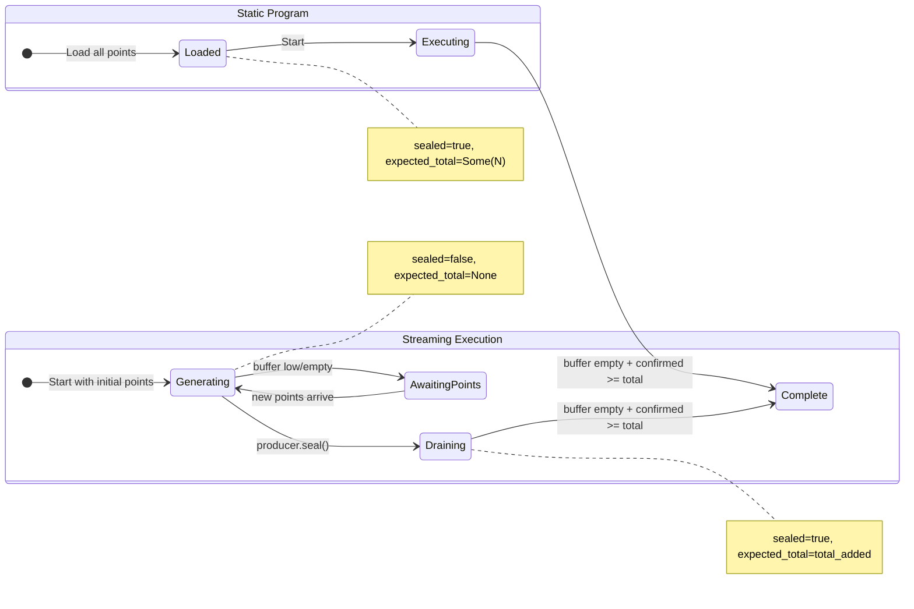
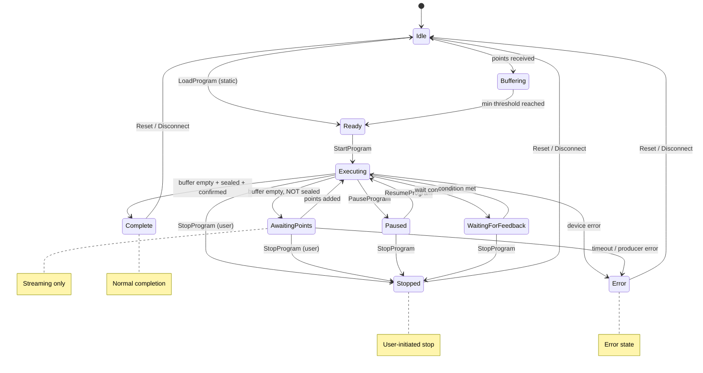
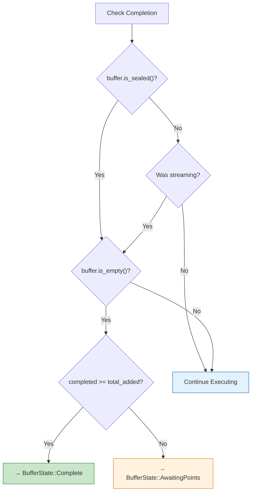
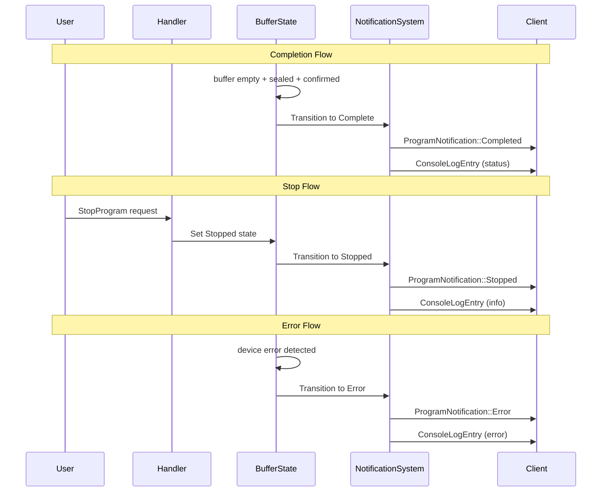
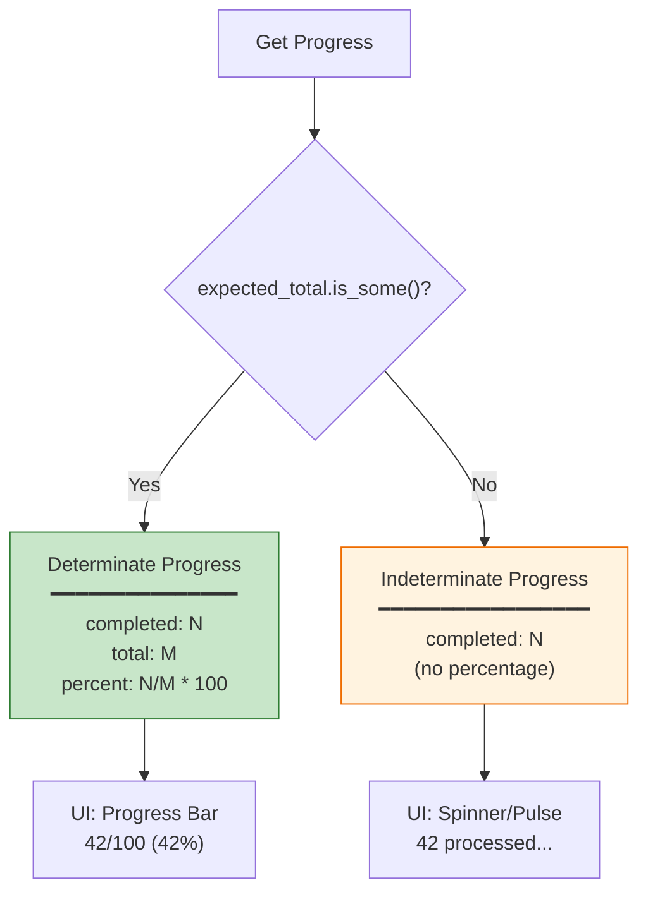
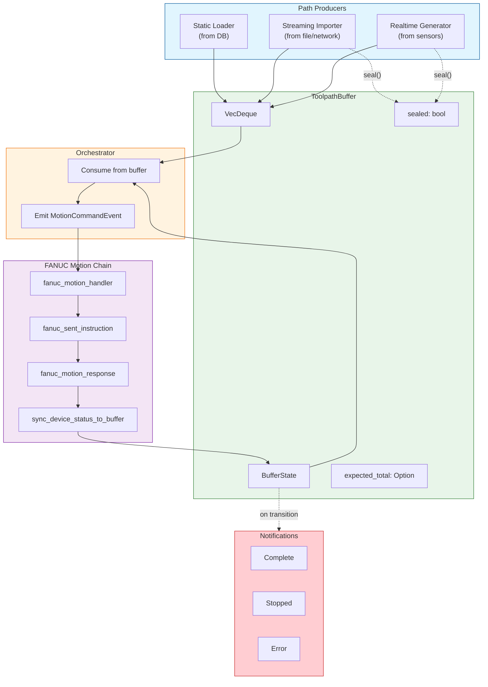
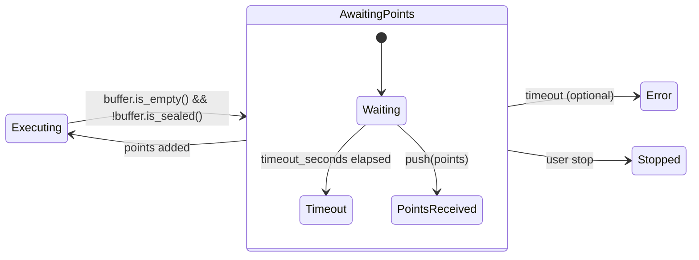

# Streaming Execution Diagrams

This document contains all diagrams for the streaming execution architecture.

## 1. Execution Modes Comparison

## 2. BufferState State Machine (Full)

## 3. Sealed Buffer Lifecycle

```mermaid
flowchart TB
    subgraph static["Static Program Flow"]
        S1["new_static(100)"] --> S2["sealed=true\nexpected=Some(100)"]
        S2 --> S3["push(points...)"]
        S3 --> S4["Executing"]
        S4 --> S5["drain buffer"]
        S5 --> S6["Complete\n(when confirmed=100)"]
    end
    
    subgraph streaming["Streaming Flow"]
        T1["new_streaming()"] --> T2["sealed=false\nexpected=None"]
        T2 --> T3["push(batch1)"]
        T3 --> T4["Executing"]
        T4 --> T5["push(batch2)"]
        T5 --> T6["...more batches..."]
        T6 --> T7["seal()"]
        T7 --> T8["sealed=true\nexpected=Some(total_added)"]
        T8 --> T9["drain remaining"]
        T9 --> T10["Complete"]
    end
    
    style static fill:#e8f5e9,stroke:#2e7d32
    style streaming fill:#e3f2fd,stroke:#1565c0
```

## 4. Completion Logic Decision Tree

## 5. Notification Flow

## 6. Progress Display Logic

## 7. System Architecture Overview

## 8. AwaitingPoints State Detail

---

*End of Diagrams Document*

