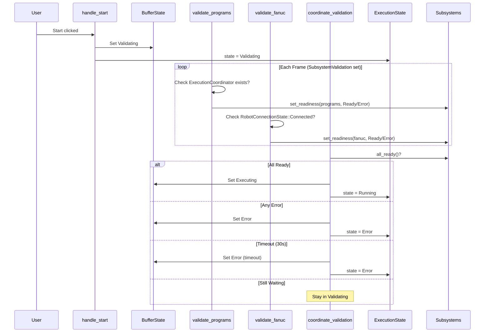

# Subsystem Validation Architecture - Implementation Complete

This document describes the implemented subsystem validation architecture for coordinating execution across multiple plugins.

## Overview

The subsystem validation architecture ensures that all required systems (programs, robot connection, etc.) are ready before execution begins. When a user clicks "Start", the system enters a **Validating** phase where each subsystem reports its readiness. Only when all subsystems report Ready does execution proceed.

## Architecture Diagram



## Key Components

### 1. Subsystems Component

Located in `execution/src/components/subsystems.rs`:

```rust
pub struct Subsystems {
    pub entries: Vec<SubsystemEntry>,
}

pub struct SubsystemEntry {
    pub name: String,
    pub readiness: SubsystemReadiness,
}

pub enum SubsystemReadiness {
    NotReady,
    Ready,
    Error(String),
}
```

**Subsystem Name Constants:**
- `SUBSYSTEM_PROGRAMS` = `"programs"`
- `SUBSYSTEM_FANUC` = `"fanuc_robot"`
- `SUBSYSTEM_DUET` = `"duet_extruder"`
- `SUBSYSTEM_EXECUTION` = `"execution"`

### 2. SubsystemValidation SystemSet

Located in `execution/src/plugin.rs`:

```rust
#[derive(SystemSet, Debug, Clone, PartialEq, Eq, Hash)]
pub struct SubsystemValidation;
```

Subsystem plugins add their validation systems to this set to ensure they run **before** `coordinate_validation`.

### 3. ValidationStartTime Resource

Located in `execution/src/systems/validation.rs`:

```rust
#[derive(Resource)]
pub struct ValidationStartTime(pub Instant);
```

Tracks when validation started for timeout functionality. Created when entering Validating state, removed when exiting.

## Files Created/Modified

### New Files

| File | Purpose |
|------|---------|
| `execution/src/systems/validation.rs` | Central validation coordinator with timeout |
| `programs/src/validation.rs` | Programs subsystem registration + validation |
| `fanuc/src/validation.rs` | FANUC subsystem registration + validation |

### Modified Files

| File | Changes |
|------|---------|
| `execution/src/plugin.rs` | Added `SubsystemValidation` SystemSet, `coordinate_validation` system |
| `execution/src/systems/mod.rs` | Export validation module |
| `execution/src/lib.rs` | Export `SubsystemValidation` |
| `execution/src/handlers.rs` | Insert `ValidationStartTime` on Start |
| `programs/src/plugin.rs` | Add `ProgramsValidationPlugin` |
| `fanuc/src/plugin.rs` | Add `FanucValidationPlugin` |

## Validation Flow

### 1. User Clicks Start

`handle_start` in `execution/src/handlers.rs`:
1. Validates current state allows starting (Ready, Completed, or Stopped)
2. Resets buffer for rerun if needed
3. Calls `subsystems.reset_all()` to clear all readiness statuses
4. Sets `BufferState::Validating`
5. Inserts `ValidationStartTime` resource
6. Updates `ExecutionState` to `Validating`

### 2. Subsystem Validation (Each Frame)

Each subsystem plugin has a validation system that runs in the `SubsystemValidation` set:

**Programs Plugin** (`programs/src/validation.rs`):
```rust
fn validate_programs_subsystem(...) {
    // Only run when Validating
    if !matches!(buffer_state, BufferState::Validating) { return; }
    
    // Check if ExecutionCoordinator exists (program loaded)
    if coordinator_opt.is_some() {
        subsystems.set_readiness(SUBSYSTEM_PROGRAMS, SubsystemReadiness::Ready);
    } else {
        subsystems.set_readiness(SUBSYSTEM_PROGRAMS, 
            SubsystemReadiness::Error("No program loaded".to_string()));
    }
}
```

**FANUC Plugin** (`fanuc/src/validation.rs`):
```rust
fn validate_fanuc_subsystem(...) {
    // Only run when Validating
    if !matches!(buffer_state, BufferState::Validating) { return; }
    
    // Check if any robot is connected
    let connected = robots.iter().any(|s| *s == RobotConnectionState::Connected);
    
    if connected {
        subsystems.set_readiness(SUBSYSTEM_FANUC, SubsystemReadiness::Ready);
    } else {
        subsystems.set_readiness(SUBSYSTEM_FANUC,
            SubsystemReadiness::Error("No FANUC robot connected".to_string()));
    }
}
```

### 3. Coordination (Each Frame, After Subsystem Validation)

`coordinate_validation` in `execution/src/systems/validation.rs`:

1. **Check Timeout**: If `ValidationStartTime.elapsed() > VALIDATION_TIMEOUT` (30s):
   - Set `BufferState::Error` with timeout message
   - Remove `ValidationStartTime` resource
   - Log timeout error

2. **Check Errors**: If any subsystem has `SubsystemReadiness::Error`:
   - Set `BufferState::Error` with error message
   - Remove `ValidationStartTime` resource
   - Log validation failure

3. **Check All Ready**: If `subsystems.all_ready()`:
   - Set `BufferState::Executing { current_index: 0, completed_count: 0 }`
   - Remove `ValidationStartTime` resource
   - Log success with elapsed time

4. **Still Waiting**: Log waiting status every 5 seconds

## System Ordering

```
SubsystemValidation (set)
├── register_programs_subsystem
├── validate_programs_subsystem
├── register_fanuc_subsystem
└── validate_fanuc_subsystem
        │
        ▼
coordinate_validation (runs after SubsystemValidation)
        │
        ▼
update_buffer_state_system
        │
        ▼
orchestrator_system
        │
        ▼
... (rest of execution chain)
```

## Adding a New Subsystem

To add a new subsystem (e.g., Duet extruder):

1. **Create validation module** in your plugin:

```rust
// duet/src/validation.rs
use fanuc_replica_execution::{
    BufferState, SubsystemReadiness, Subsystems, SubsystemValidation, SUBSYSTEM_DUET,
};

pub fn register_duet_subsystem(
    mut systems: Query<&mut Subsystems, With<ActiveSystem>>,
    mut registered: Local<bool>,
) {
    if *registered { return; }
    if let Ok(mut subsystems) = systems.single_mut() {
        subsystems.register(SUBSYSTEM_DUET);
        *registered = true;
    }
}

pub fn validate_duet_subsystem(
    extruders: Query<&ExtruderStatus, With<DuetExtruder>>,
    buffer_state_query: Query<&BufferState, With<ActiveSystem>>,
    mut subsystems_query: Query<&mut Subsystems, With<ActiveSystem>>,
) {
    // Only validate when Validating
    let Ok(buffer_state) = buffer_state_query.single() else { return; };
    if !matches!(buffer_state, BufferState::Validating) { return; }
    
    let Ok(mut subsystems) = subsystems_query.single_mut() else { return; };
    
    // Check extruder readiness
    let ready = extruders.iter().any(|s| s.is_ready);
    if ready {
        subsystems.set_readiness(SUBSYSTEM_DUET, SubsystemReadiness::Ready);
    } else {
        subsystems.set_readiness(SUBSYSTEM_DUET,
            SubsystemReadiness::Error("Extruder not ready".to_string()));
    }
}

pub struct DuetValidationPlugin;

impl Plugin for DuetValidationPlugin {
    fn build(&self, app: &mut App) {
        app.add_systems(Update, register_duet_subsystem);
        app.add_systems(Update, validate_duet_subsystem.in_set(SubsystemValidation));
    }
}
```

2. **Add plugin to main plugin**:

```rust
// duet/src/plugin.rs
app.add_plugins(DuetValidationPlugin);
```

## Timeout Configuration

The validation timeout is defined in `execution/src/components/buffer.rs`:

```rust
pub const VALIDATION_TIMEOUT: Duration = Duration::from_secs(30);
```

To change the timeout, modify this constant.

## Error Handling

### Subsystem Errors

When a subsystem reports an error (e.g., "No FANUC robot connected"):
- `coordinate_validation` detects via `subsystems.first_error()`
- Sets `BufferState::Error { message: "..." }`
- Sets `ExecutionState.state = SystemState::Error`
- User sees error message and can retry after fixing the issue

### Timeout Errors

When validation times out:
- Error message includes which subsystems were not ready
- Example: `"Validation timed out after 30s. Not ready: fanuc_robot, duet_extruder"`

### Recovery

After an error:
- User can unload/reload program
- User can fix connection issues
- User can click Start again to retry validation

## Logging

The system provides detailed logging:

- `📦 Set BufferState to Validating for 'program_name'` - Validation started
- `📋 Registered 'programs' subsystem` - Subsystem registered
- `⏳ Validation waiting (5s/30s) for subsystems: ["fanuc_robot"]` - Every 5s while waiting
- `✅ Validation succeeded for 'program_name' in 1.234s, starting execution` - Success
- `❌ Validation failed for 'program_name': No FANUC robot connected` - Error
- `⏱️ Validation timeout for 'program_name': ...` - Timeout

## Testing

To test the subsystem validation:

1. **Happy Path**: Load program, connect robot, click Start → Should transition to Executing
2. **No Program**: Don't load program, click Start → Should error "No program loaded"
3. **No Robot**: Load program, don't connect robot, click Start → Should error "No FANUC robot connected"
4. **Timeout**: Mock a subsystem that never reports ready → Should timeout after 30s
